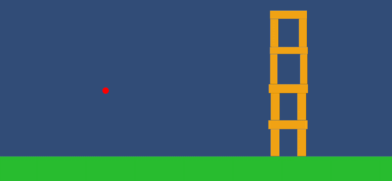

# Unity 2D Mobile Ball Launcher Prototype

A small Unity gameplay prototype created to explore **mobile touch input systems, physics-based mechanics, and performance-friendly gameplay architecture**.

This project was developed as part of my process of adapting my existing game development knowledge to the **Unity engine and mobile gameplay patterns**.

The goal of this prototype is not to create a finished game, but to implement and experiment with **core gameplay systems commonly used in mobile games**.

---

---

# Gameplay Overview

The player pulls a ball away from a pivot point and releases it to launch it using a **physics-based slingshot mechanic**.

The system supports **multi-touch input**, limits the maximum pull distance, and launches the ball using a **SpringJoint2D setup**.

When the ball leaves the screen or slows down too much, it automatically returns to the **object pool**, allowing the next ball to spawn.

---

# Core Systems Implemented

### Mobile Touch Input
Uses Unity's **Enhanced Touch Input System** to handle mobile-friendly touch interactions.

Features:
- Multi-touch support
- Average touch position calculation
- Drag detection
- Release detection

---

### Physics-Based Launching
A **SpringJoint2D** is used to simulate a slingshot mechanic.

Features:
- Pull and release gameplay
- Physics-based launch
- Adjustable pull distance
- Pivot-based launch origin

---

### Object Pooling System
To avoid runtime instantiation costs, the project uses a **ball pooling system**.

Features:
- Pre-instantiated ball pool
- Reusable rigidbodies
- Automatic respawn when a ball becomes inactive

---

### Pull Distance Limiting
The ball cannot be pulled beyond a maximum distance from the pivot.

This ensures:
- predictable gameplay
- stable physics behavior
- controlled launch power

---

### Out-of-Bounds Detection
The ball automatically returns to the pool when it leaves the screen bounds.

Viewport space checks are used to determine whether the ball is outside the visible camera area.

---

### Idle Ball Cleanup
If the ball slows down below a minimum speed for a certain amount of time, it will automatically despawn.

This prevents balls from lingering in the scene indefinitely.

---

### Mobile Performance Considerations

This prototype includes several performance-friendly practices:

- Object pooling
- Disabled VSync
- Fixed target frame rate (60 FPS)
- Lightweight physics interactions
- No runtime allocations in gameplay loops

---

# Technical Features

Unity systems used in this project include:

- Unity Input System
- Enhanced Touch Support
- Rigidbody2D Physics
- SpringJoint2D
- Object Pooling
- Viewport Position Checks
- Coroutine-based timing
- Serialized gameplay parameters

---

# Project Structure
- Scripts
- BallHandler.cs
- Ball.cs
- GameSettings.cs

**BallHandler**

Manages:
- ball spawning
- touch input
- pulling mechanic
- launch logic
- object pool

**Ball**

Handles:
- speed checks
- out-of-screen detection
- auto-return to pool

**GameSettings**

Configures performance settings:
- target frame rate
- VSync behavior

---

# Why This Prototype Exists

This project was built to **practice implementing real gameplay systems inside Unity**, particularly those commonly found in **mobile games**.

The focus was on:

- Unity workflow familiarity
- touch input handling
- gameplay system architecture
- performance-aware coding

---

# Future Prototype Projects

As part of the same learning process, additional mobile-focused prototypes are planned:

**Simple Driving Prototype (Unity 3D)**  
A simple third-person driving prototype where the car turns left or right based on screen input while avoiding obstacles.

**Meteor Mayhem (Unity 2D)**  
A top-down space survival prototype where the player avoids incoming asteroids.
